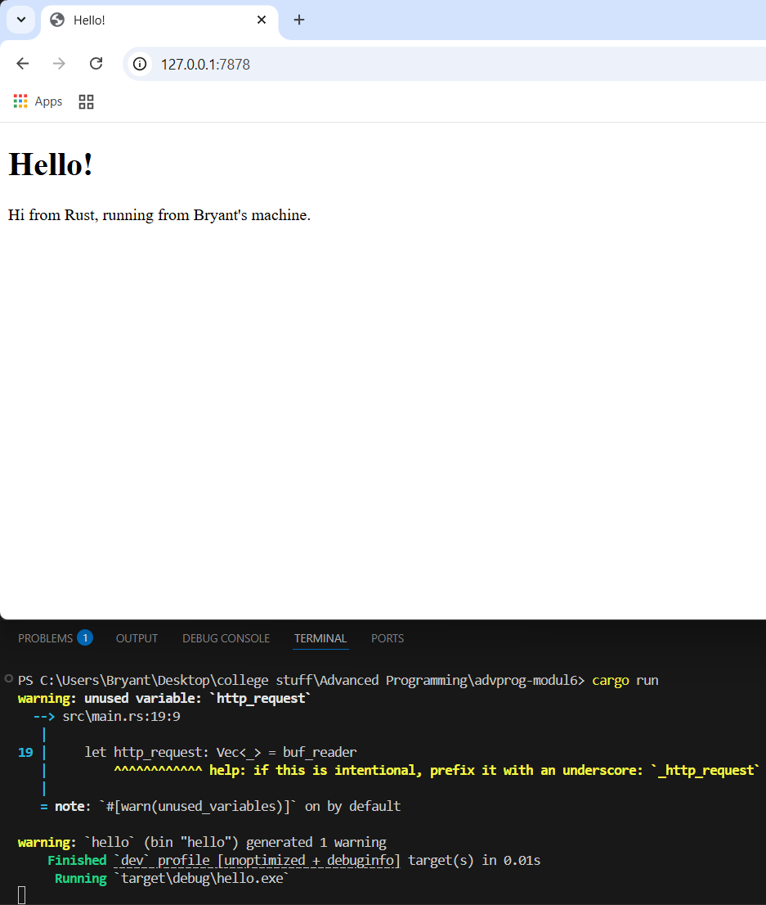

## Module 6
### Commit 1 Reflection Notes
The `handle_connection` method is responsible for processing incoming HTTP requests over a TCP connection. The method takes a mutable reference to a `TcpStream` as an argument. `TcpStream` represents an connection between the client and the server.

The function first creates a new BufReader to wrap the TcpStream. This allows more efficient reading of the data by buffering the input. It reads the data in chunks, reducing the number of input/output operations required and improving the performance.

After that, the buffered stream is read. `.lines()` returns an iterator for each line of the buffered stream. Each line is a `Result`. After this, the `.map` method takes each result in each line and unwraps it, ensuring that only the actual content (the lines of the HTTP request) is extracted.

`.take_while(|line| !line.is_empty())` collects the lines until an empty line is encountered. In HTTP requests, the end of the request headers is signified by an empty line, so this ensures that we capture only the request headers. Finally, `.collect()` collects all the lines into a `Vec<String>`, resulting in a vector of strings which represent the HTTP request headers.

At the end, the method prints the HTTP request headers to the console. The `{:#?}` formatting specifier is used to print the `Vec<String>` in a more readable format (pretty-printed).

### Commit 2 Reflection Notes

In the new `handle_connection` method, the `buf_reader` and `http_request` variables were the same as before. After this, the `status_line` line contains the HTTP response `"HTTP/1.1 200 OK"`, indicating that the request was successful.

After this, the program reads the contents of the `hello.html` file and returns it as a string in the `contents` variable. After this, the content's length is calculated using the `.len()` method3 and stored in the `length` variable.

The full HTTP response is then created by combining the `status_line`, `length`, and `contents`. This response is then sent back to the client through `TcpStream` (first it is converted to bytes using `.as_bytes()`). This makes the server respond with a basic HTML file (in this case, `hello.html`).
